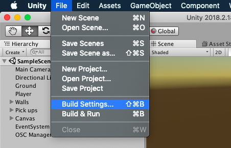
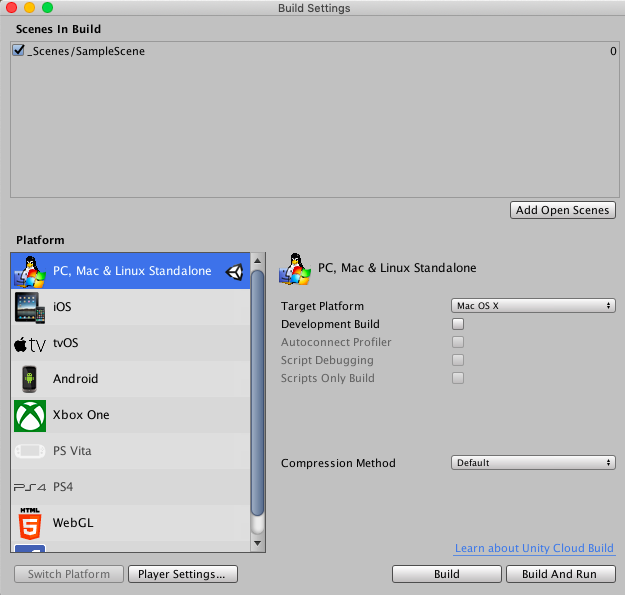

## Building Unity applications
So you finished developing your project and now you want to run it.
Assuming the app you have created is compiled without problems,
appearing on the console on the bottom of the Unity platform you are
ready to run the build process. Go to the menu of Unity and press file >
build settings:

This will open another window which will allow you to build your app for
various devices including computers, mobile, and various operating
systems.

That's it, you just created your first Unity project which you can
deploy on any device you like, with some further configurations, for
example, if you want to build for iOS then Unity will create an "xcode"
project; then you can build your app from there, bear in mind that many
terms and conditions will apply in order to deal with _eΛ1l_ corp.

Finally, to make my life easier I made an AppleScript utility that runs
SuperCollider on my computer and loads the Unity app. Running the
utility will open a terminal window and run `sclang` executable, not the
IDE etc. Once sclang starts in the terminal window it will run the .scd
file you created in this step:

