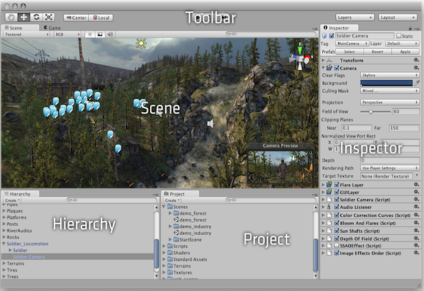
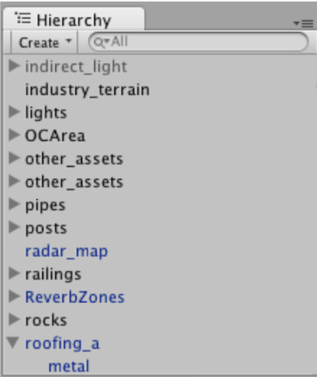
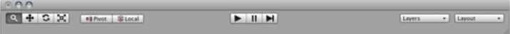
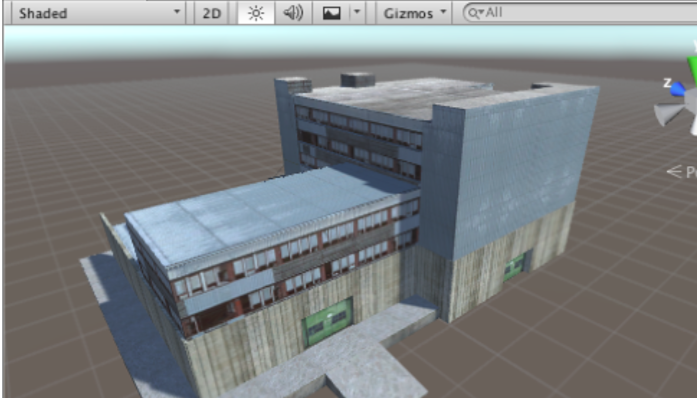
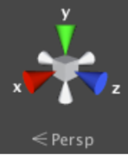
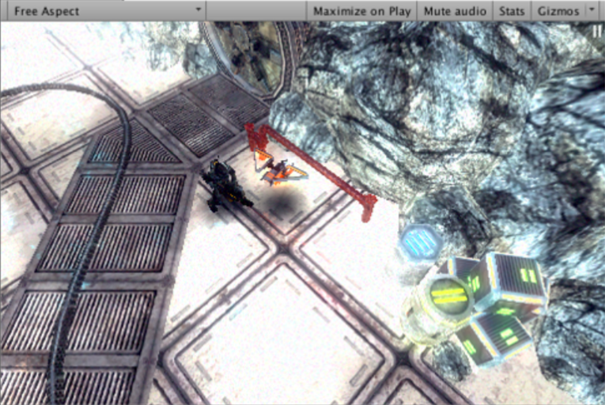
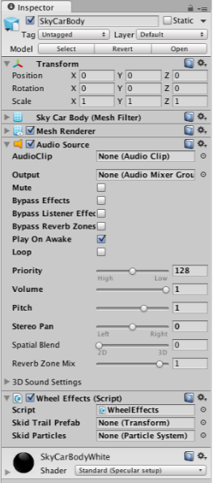

---
Introduction in Unity
---
This week we will look in the Unity game platform. For some information
about Unity see this (link)[https://unity3d.com/], and this video about
some (basics)[https://www.youtube.com/watch?v=Hu7PMTWyULw] of Unity.

## Unity basics
Unity is a (cross-platform) game engine, which allows you to create
apps, that run on mobile devices and web browsers. It allows us to
create (2d and 3d) video games and interactive graphics and even virtual
reality applications.

Since we are looking it from a Sonic Artist's prerogative, and thus we
are very keen in designing *interactive sound*, Unity allows us to
create OSC implementation and communicate with any sound design platform
that provides OSC protocol communication in real time, for example,
SuperCollider, Pure Data, and MaxMSP. For an introduction of Unity see
this (video)[https://www.youtube.com/watch?v=Hu7PMTWyULw].

### The Unity ecosystem
First and foremost, download Unity and install it using its install
assistant, (here.)[https://store.unity.com/download?ref=personal] Check
this (page)[https://docs.unity3d.com/Manual/InstallingUnity.html] for
details about installing Unity on your machine. Unity comes in various
versions: the personal, which is the free version, and the payed
version, which is the professional package. During installation it will
ask you whether you want to install other things such as a designated
IDE for Unity, I am mostly using Atom and all tutorials will take place
there but you can select your IDE for working in Unity. Eventually you
will get there in no time.

#### Coding in Unity
Unity is a scripting environment and it used to allow to code
applications in two main languages, C# and a variant of Javascript named
Unityscript, alas it only supports the former now. The next
(video)[https://unity3d.com/learn/beginner-tutorials] will take out some
questions if these already sound a bit obfuscating and scary.

### The Unity interface
Navigating Unity consists of five main panels or Unity views each
providing a different set of functions and configurations for the
project building:  
+ Scene (construct the game)
+ Game-view (preview when press play)
+ Hierarchy (show parenting)
+ Project panel(showing everything)
+ Inspector (shows properties)

See the interface in this image below:

Pressing the play |> button on the toolbar on top and middle of the
interface will compile everything and will allow you to preview the
game. The official Unity web page provides a video tutorial for each
part of the interface as beginner tutorials. Before we jump in to our
first project in Unity is essential to understand the Unity basics
explained in the videos.

Unity provides a set of ready made objects to create your projects,
named: `gameObjects` every object in Unity is a `gameObject`. Each
object doesn't really provide any functionality until you assign to them
using the `components`. These are specific functions that you can load
to each `gameObject`. You can think of this as an empty object that you
load it with something specific thus it defines its functionality. Unity
provides ready made `components`, such as lighting, Physics etc. you may
expand the components library by programming new ones.

Project panel show your assets, that is basically everything that you
are using inside your project, for example, scripts, materials and extra
libraries etc.. and this section allows you to manage your project. This
window is a typical browser as something you are using to change the
structure in the Finder (MacOS) window of your computer.  

Next is the Hierarchy section

Unity use the idea of Hierarchy, which means you can create elements
which are `childs` of something, known as the `parent`. That is
inheriting something from the `parent`, which allows you to create many
things based in just one, thus you only have to create that one. See it
as cloning of something and repeating it as many times as you need
without the need to recreate it all the time. So anything you create
like this it will inherit everything you have applied to the `parent`.

Here are some more controls that you will be using in Unity:

 Transform tools, used for Scene view.

 Gizmo tools, used for changing the
appearance of Scene view.

 Layers Drop Down, you can control which objects
will appear.

 Layout, controls the positioning of the View.

The Scene View

Scene view is used to add all your elements and objects, and is the
place to interact mainly with the platform.

On the top right of the scene view there is a coloured compass which
shows the orientation of the camera which allows you to manipulate the
angle of the camera scene.

Next, is the game view. This is compile version of the project, can be
seen as the final output of the game and allows to preview how it's
working. Any changes you will do on the game will be available once you
stop the game view and run again the play mode.

Here you can find some of the most functionalities offered by the
`gameObjects` you are using, for example, lighting and audio sources you
have added on it. Moreover, you may manipulate variables that you have
created and assigned in your scripts, for this the variables must be
created as `public` instead of `private`. More on this later. Now take a
look to wrap up all the basic stuff we covered so far and experiment
with some `gameObjects` also try different modes and try to change
orientation settings in the game view.

Online documentation of the Unity can be found at this link:
http://docs.unity3d.com/Manual/
