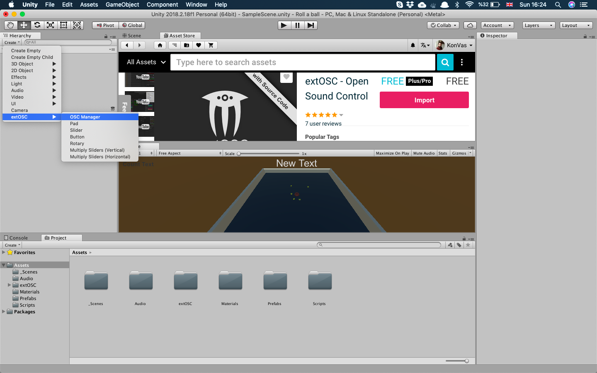

## Unity and SuperCollider
See first this (link)[https://www.youtube.com/watch?v=p7rG6EPVt80] for
an introduction of the concept. Unity has already a ready made
implementation of OSC communication provides as a free asset, named
`extOSC`. For more information see this page in Unity
(website)[https://assetstore.unity.com/packages/tools/input-management/extosc-open-sound-control-72005].  Then, once you have downloaded the Asset in your project you can load it as a component and start mapping it with any other application that receives OSC messages. Using this asset does not require any coding.

To use the OSC library we need install it and import it inside our
project. Unity provides an online system for this, where you can search
and download any asset you are looking for and then import it in your
project, accesed through the asset store as seen below.

Once you download it you can import it as seen below, it also asks which
folder you will need.

Go to Hierarchy and press on the create button just below. Opening the
OSC manager from the lib you will be able to select the remote address
in order to send the OSC messages.  

To send to SuperCollider we will type the localhost address, and the
language's port, that is:

> Remote Port: `57120`

Similarly, you can map things in the same way for receiving OSC in Unity
as seen below:

Some things are not possible to be done with the inspector so you will
have to spend some time to hard code some functionalities.  

Moving to the script side, first and foremost as we saw in other
programming languages covered this semester, we need to denote which
libraries we are going to use inside our script.

In order to implement the OSC message we will need to create it inside
our function that we are using for making the player, or the ball that
is used as the player object.

 > trigger the OSC message from the OnTriggerEnter function.

 Provided we have created this above, we can create then a public
variable with the message we want to send without hardcoding it all the
time and thus this will allow us to use in our program.  

 

 > See the osc msg '/picktrig' available to the inspector.

 Once this is implemented in the Unity project, SuperCollider can
receive the OSC messages. To do this we need to create an OSC receiver,
note that the OSC message must be identical, that is `'/picktrig'` if
these two are not identical SC will fail to receive anything and thus
there won't be any communication between the two applications.

 
 > see the messages SC is receiveing right on the post window.

Press |> and see the communication is going through.
